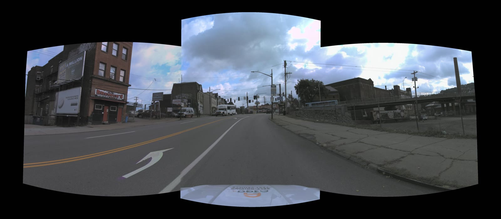

# LiDAR-TPS Video Stitching Pipeline

Master's thesis (30 hp) — *Video Stitching for Remote Operation of Cabinless
Autonomous Trucks*, Erik Näslund, Uppsala University, June 2026.

LiDAR-guided Thin-Plate Spline pipeline that stitches three forward-facing
Argoverse 2 ring cameras (FL, FC, FR) into a 5238 × 2303 cylindrical panorama
at ≈ 28 ms / frame (~36 Hz) on a laptop GPU (RTX 3050 Ti). Evaluated against
SIFT and LiDAR-homography baselines on 10 AV2 logs across 4 cities;
**+6.0 / +7.4 dB Y-PSNR** over SIFT, **+6.2 / +7.4 dB** over the homography
baseline (n = 378 / 528 paired frames).

## Demo

[](docs/demo.mp4)

Three ring cameras fused into one cylindrical panorama under the video-streaming
preset. Click the image to play [`docs/demo.mp4`](docs/demo.mp4).

## Repository layout

```
code_folder/
  02_implementations/
    lidar_tps_pipeline/   # CUDA C++ pipeline; binary: lidartps
                          #   utils/lidar_ring_stitch.py — Python reference
  03_eval/                # SIFT + LiDAR-homography baselines, 10-log CSVs
sample_data/              # One AV2 frame for smoke-testing (no full dataset needed)
docs/                     # Demo video + poster
```

## Dependencies

| Requirement | Version |
|---|---|
| CUDA toolkit | 12.4+ (tested SM 8.6, RTX 3050 Ti) |
| CMake | ≥ 3.18 |
| OpenCV | ≥ 4.5 (CUDA build for NVENC output) |
| GCC | C++17 |
| Python | ≥ 3.10 (`numpy`, `matplotlib`, `opencv-python`, `scipy`) |

## Build

```bash
cd code_folder/02_implementations/lidar_tps_pipeline
mkdir -p build && cd build
cmake .. -DCMAKE_BUILD_TYPE=Release
make -j$(nproc)
```

Produces the `lidartps` binary.

## Quick run (sample data — no dataset download needed)

A single AV2 frame is included in `sample_data/` for immediate testing:

```bash
# from repo root, after building
code_folder/02_implementations/lidar_tps_pipeline/build/lidartps \
    --calib  sample_data/calibration.json \
    --frames sample_data/frames.json \
    --lidar  sample_data/sensors/lidar \
    --frame  0 --out /tmp/sample_out
```

Expected output: `/tmp/sample_out/frame_0.jpg`, a 5238 × 2303 cylindrical
panorama, in ~40 ms on an RTX 3050 Ti.

## Full dataset

The evaluation uses ten AV2 `sensor/train` logs. Download from
<https://www.argoverse.org/av2.html> (CC BY-NC-SA 4.0) and place logs under
`argo2_data/`. Extraction utilities in
`code_folder/02_implementations/lidar_tps_pipeline/utils/` produce the layout
the binary expects (`calibration.json`, `frames.json`, `sensors/lidar/*.bin`).

Run a frame from a full log:

```bash
./lidartps --calib  ../../../../argo2_data/extracted/calibration.json \
           --frames ../../../../argo2_data/extracted/frames.json \
           --lidar  ../../../../argo2_data/extracted/sensors/lidar/ \
           --out    ../output/stitched --frame 0
```

The default configuration is image mode. Video-streaming mode (TPS λ=1 +
displacement-field temporal IIR) is enabled via `--video-preset`. See
`code_folder/02_implementations/lidar_tps_pipeline/ARCHITECTURE.md` and
`DESIGN_CHOICES.md` for the full flag reference.

## Reproduce evaluation results

```bash
cd code_folder/02_implementations/lidar_tps_pipeline
python utils/eval_pipeline.py   # --metrics for a cheap pass; --eval-dump for full
```

Aggregation and baseline comparisons live in `code_folder/03_eval/`.

## License

Pipeline source code is the author's work. AV2 data is not redistributed and
remains under the Argoverse 2 license (CC BY-NC-SA 4.0) at the upstream site.
